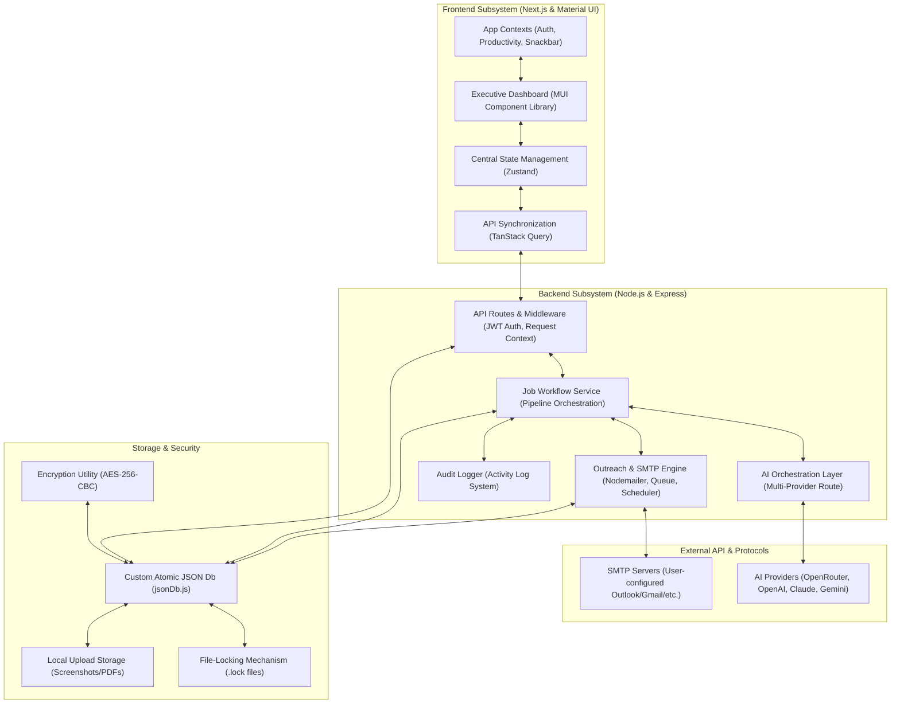

# CareerBot AI Job Automation Platform: Project Overview & System Architecture

CareerBot AI is a production-grade, local-first career automation ecosystem built with Next.js and Node.js. It leverages multi-model LLM integration to streamline the job application lifecycle. The platform automates resume tailoring, cover letter generation, and cold email outreach while enforcing strict data privacy through a custom atomic JSON persistence layer and secure AES-256-CBC credential encryption.

---

## 1. High-Level System Architecture

CareerBot is engineered as a decoupled, full-stack application. It features a modern, responsive **Next.js/React frontend** optimized for a dark-mode premium executive experience, alongside a **Node.js/Express.js backend** built for low-latency AI orchestration, queue scheduling, and robust local persistence.



---

## 2. Core Modules & Functionalities

### 🛡️ 1. Multi-Model AI Orchestration Layer
The core intelligence engine supports seamless multi-provider routing across **OpenRouter, OpenAI, Anthropic Claude, and Google Gemini**.
*   **Prompt Standardization & Isolation:** System-wide prompts are cataloged in `server/services/ai/featureConfigs.js` and governed by strict guidelines in `AI_GENERATION_STANDARDS.md`.
*   **Security & Anti-Injection Guardrails:** Implements untrusted boundary wrappers (`wrapUntrustedBlock`) for job descriptions and candidate inputs to prevent prompt injection attacks.
*   **Structured JSON Output Parser:** A post-processing pipeline that strips Markdown fences, repairs trailing commas, and enforces object keys according to specific schema versions.
*   **Four-Tier Retry Escalation:**
    1.  *Standard:* Configured model with default temperature.
    2.  *Coercion:* Lower temperature, appended structure reminder.
    3.  *Strict:* API-level strict JSON mode enabled, shortened context, optional provider-level model substitution.
    4.  *Deterministic Local Fallback:* Fails gracefully into a local ATS rule engine (`scoreATS`) shaped like the AI output so the UI never breaks.

### 💼 2. Job Intake & ATS Scoring Engine
Allows candidate job management with integrated parsing, multi-modal screenshot reading, and gap analysis.
*   **Intake Types:** Supports manual paste, text extraction, and screenshot parser capabilities (via multimodal Vision models) to digitize job requirements.
*   **ATS Analyzer:** Performs keyword extraction, semantic matches, and reports missed criteria alongside a mathematically calculated ATS score (0-100%).
*   **Local Rule Matcher:** Uses standard regex tokenizers to cross-reference career profile skills against job descriptions when AI is unavailable.

### 🔄 3. Automated Content Generation Pipeline
Orchestrates a comprehensive pipeline for generating draft materials for a given job and profile pair:
*   **Tailored Resumes:** Formulates ATS-compliant resumes highlighting matching projects and technical proficiencies.
*   **Persuasive Cover Letters:** Crafts hyper-relevant, professionally styled introduction letters.
*   **Hyper-Personalized Cold Emails:** Generates outbound drafts using recipient contact information, custom tone variables, and profile summary points.

### 📧 4. Professional Outreach & SMTP Engine
A secure outbound communication manager allowing direct emails to corporate recruiters and hiring managers.
*   **Decoupled SMTP Configurations:** Users configure custom mail profiles (SMTP server, port, credentials).
*   **AES-256-CBC Cryptography:** Critical credentials (SMTP passwords) are fully encrypted before writing to storage using random IVs, secured by a unique global secret key (`CRYPTO_SECRET_KEY`).
*   **Draft Approval Workflow:** Enforces manual human verification. No email can leave the server unless it has been marked as `approved` by the user in the UI.
*   **Outreach Queue & Bulk Scheduler:** Offers automated scheduling configurations to space out email sending, avoiding rate limits and email provider flags.

### 💾 5. Custom Local-First Persistence Layer (`jsonDb.js`)
*   **Atomic Write Security (`atomicWrite`):** Mitigates file corruption by writing content to random `.tmp` files first, performing a synchronous atomic rename (`renameSync`) over the target file only upon successful serialization.
*   **Concurrent Mutex Lock (`withLock`):** Utilizes custom file-system locking through standard system flags (`wx`) on `.lock` files, spinning for up to 200 retries to prevent race conditions from concurrent Express route requests.
*   **Data Integrity & Migrations:** Features an ownership migration engine (`migrateOwnership.js`) and database structure normalizing utilities (`normalizeStorage.js`) to guarantee multi-tenant/multi-user data sandboxing.

---

## 3. Detailed Feature-Specific Execution Flows

Each high-impact capability in CareerBot operates through a structured backend execution sequence, combining user actions, file security, local computing, and LLM providers.

### 🔑 A. User Authentication & Authorization Flow
*   **Signup Sequence:**
    1.  User enters `name`, `email`, and `password` (minimum 6 characters required).
    2.  `authController.js` hashes the password using `bcryptjs` with **10 rounds of salt**.
    3.  A unique `UUID v4` is assigned to the user entity.
    4.  The user record is saved securely via `userRepository.js` using the atomic `jsonDb.js` engine.
    5.  A JSON Web Token (JWT) is signed containing the user ID, email, name, and role.
    6.  The token is returned to the client and stored in the client application context.
*   **Login & Session Validation Sequence:**
    1.  User credentials are submitted to `/api/auth/login`.
    2.  `userRepository.js` runs a query to locate the record by lowercased email.
    3.  The database `passwordHash` is decrypted and compared against the user-supplied string using `bcryptjs.compare`.
    4.  If valid, a fresh JWT is generated (`signToken`).
    5.  All subsequent protected requests route through the `requireAuth.js` Express middleware, which decodes the JWT, verifies session validity, and populates `req.user` context.

### 📷 B. Multi-Modal Job Intake & Image Parsing Flow
*   **Workflow Sequence:**
    1.  The user uploads a job description screenshot or PDF file through the `JobInputForm.tsx` dashboard widget.
    2.  The request hits `POST /api/jobs/parse-image` handled by Express with `multer` memory storage validation (restricting file sizes to 5MB or less).
    3.  The backend converts the file buffer into a raw Base64 string (`req.file.buffer.toString('base64')`).
    4.  The Base64 string is bundled into a multimodal request payload along with the `job_extraction_image` prompt template.
    5.  The system calls a Vision model (e.g. `openai/gpt-4o`) via `aiService.js` with temperature `0.1` for maximum extraction determinism.
    6.  The vision model returns structured stringified text containing parsed details (title, company, skills, description).
    7.  The custom backend post-processor parses the JSON, deduplicates extracted skills arrays, appends standard schemas, and sends the structured job metadata back to the client.

### 📊 C. Local & AI-Augmented ATS Scoring Flow
*   **Workflow Sequence:**
    1.  When a job is parsed or updated, the system triggers the matching engine (`atsEngine.js`).
    2.  **Tier 1 (AI Orchestrated Analysis):**
        *   Retrieves the standard `ats_analysis` prompt template.
        *   Wraps the raw job description and career profile within clear Markdown boundary flags to prevent prompt injection.
        *   Requests a structured evaluation from the configured AI provider using the strict 3-attempt escalation process.
        *   Parses, sanitizes, and deduplicates the response to extract matching/missing keywords and compute the semantic confidence score.
    3.  **Tier 2 (Deterministic Local Fallback):**
        *   If the AI provider is unavailable, times out, or fails JSON parsing after 3 attempts, the engine falls back to `atsEngine.js`.
        *   Normalizes and tokenizes both the job text and the candidate's profile skills.
        *   Runs an exact string-matching and fuzzy keyword search across the job content.
        *   Calculates a synthetic match score based on keyword overlaps and skill density.
    4.  Updates the target job record with `atsScore`, `atsBreakdown`, and writes an execution record to the system audit logs.

### 🔄 D. Orchestrated Generation Pipeline Flow
*   **Workflow Sequence:**
    1.  Triggered by `POST /api/workflow/run` with `jobId` and `profileId`.
    2.  The backend initializes the `jobWorkflowService.js` and writes a `WORKFLOW_STARTED` audit event.
    3.  **Parallel Tasks Initiation:**
        *   **Resume Generation:** Resolves `resume_generation` model mappings. Sends the candidate's career profile and parsed job details to the LLM. Generates an ATS-aligned text resume and saves it as a `draft` document.
        *   **Cover Letter Generation:** Resolves `cover_letter_generation` prompt parameters. Passes company metadata, titles, and profile details to the model to generate a custom cover letter draft.
        *   **Cold Email Drafting:** Calls the `email_generation` model to write a personalized outreach email. The model splits the output into explicit `SUBJECT:` and `BODY:` headers.
    4.  **Local Scoring:** The email body is routed through `emailScorer.js` to calculate individual indices for Personalization, Relevance, and Tone.
    5.  All drafts are stored in the atomic JSON database with `draft` status, linked back to the parent `jobId`, and tracked in audit histories.

### 🔒 E. SMTP Setup & AES-256-CBC Encrypted Password Flow
*   **Configuration & Encryption Sequence:**
    1.  User enters host, port, email address, and SMTP app password into the `smtp-configurations` setting panel.
    2.  The request hits `POST /api/smtp`.
    3.  The utility `encryption.js` reads the unique hex secret `CRYPTO_SECRET_KEY` from environment variables.
    4.  A cryptographically random **16-byte Initialization Vector (IV)** is generated.
    5.  An AES-256-CBC cipher encrypts the plain SMTP app password.
    6.  The encrypted password and the hex IV are saved as a structured configuration block in `smtp.json`.
*   **On-the-fly Decryption & Send Sequence:**
    1.  When an outreach task is triggered, the system fetches the default active SMTP configuration.
    2.  `smtpRepository.js` reads the encrypted password hex and IV hex.
    3.  Using `crypto.createDecipheriv` with the same `CRYPTO_SECRET_KEY`, the app decrypts the hex string back to a UTF-8 SMTP authentication password.
    4.  The decrypted password is piped directly to `nodemailer.createTransport`, leaving no unencrypted passwords stored in memory or written to disk.

### ✉️ F. Sequenced Email Queue Flow
*   **Queueing Sequence:**
    1.  When an approved single/bulk outreach is dispatched, the system calls `enqueue()` inside `emailQueue.js`.
    2.  The email payload (target address, subject, rendered HTML body, attachments) is pushed onto an in-process FIFO array.
    3.  The queue processor starts sequential operations with **Concurrency = 1** to prevent rate limits or spam blocks.
    4.  For each queued email, the system launches the Nodemailer SMTP worker.
    5.  **Robust Retry Loop:**
        *   If sending fails due to minor network issues, the queue halts and initiates a retry loop up to **3 max attempts**.
        *   Uses progressive delay scaling (`RETRY_DELAY_MS * attempt_number`) before launching subsequent runs.
        *   If all 3 attempts fail, the email is marked as `failed`, callbacks update the database state, and audit logs are recorded.
    6.  Between successful sends, the process executes a small cooldown delay (`sleep(500)`) before popping the next job from the queue.

### 📅 G. Multi-Stage Automated Follow-up Scheduling Flow
*   **Workflow Sequence:**
    1.  Users configure a scheduling profile (e.g. Weekly or Monthly triggers, exact hour settings, and a list of target recipients).
    2.  A cron job periodically pings the `/api/schedule/run` trigger endpoint.
    3.  The `scheduler.js` engine filters for enabled schedules due for the current UTC hour, day of the week, or day of the month.
    4.  **Multi-Stage Status Progression Check:**
        *   Loops through up to 4 follow-up stages (`scheduleOne`, `scheduleTwo`, `scheduleThree`, `scheduleFour`).
        *   If a stage is marked `sent`, it skips to evaluate the next follow-up.
        *   If a stage is marked `void`, the recipient is marked `disabled` and follow-ups are halted.
        *   Ensures progression logic (e.g. stage 2 cannot queue unless stage 1 has been successfully marked as `sent`).
    5.  Resolves the corresponding template parameters, personalizes variables, and triggers `enqueue()` to schedule delivery.
    6.  Upon dispatch completion or errors, callback hooks dynamically update specific stage indicators (`statuses[key] = 'sent' | 'failed' | 'void'`) inside `schedules.json`.

### 🗄️ H. Scoped JSON Database Mutex & Mutex Locking Flow
*   **Read / Write Locking Sequence:**
    1.  Any Express route requesting repository operations runs a transaction within `withLock(filename, fn)` in `jsonDb.js`.
    2.  The engine checks if a locking file exists (e.g. `users.json.lock`).
    3.  If a lock exists, it suspends execution and retries at 5 millisecond intervals for up to **200 retries** (up to 1 second lock lifetime protection).
    4.  If the lock does not exist, it executes a write operation using standard system flags `wx` (exclusive write) containing the current process ID.
    5.  With the database secured, the target repository executes operations (e.g. `safeRead` or `atomicWrite`).
    6.  **Atomic Persistence Execution:**
        *   When updating, the model serializes the content into a temporary random file (e.g. `users.json.168547.tmp`).
        *   Upon successful serialization, `fs.renameSync` atomic file replacement swaps the `.tmp` file directly over the target `users.json`.
        *   If any write step fails, the temporary file is unlinked, preserving the original file.
    7.  The `finally` block unlinks the lock file (`users.json.lock`), releasing the mutex for concurrent queue tasks.

---

## 4. End-to-End System Workflow


The flowchart below outlines the step-by-step automation execution pipeline when a user imports a new job:

```mermaid
sequenceDiagram
    autonumber
    actor User
    participant FE as Next.js UI (Dashboard)
    participant BE as Express.js Server
    participant DB as Atomic JSON DB (jsonDb.js)
    participant AI as Multi-Provider AI Engine
    participant SMTP as Outreach Engine (SMTP/Queue)

    User->>FE: 1. Paste Job Details / Upload Screenshot
    FE->>BE: POST /api/jobs (raw content)
    BE->>BE: Execute Job Parser / OCR
    BE->>DB: Save Job Profile (Status: Raw)
    BE->>FE: Return Created Job ID

    User->>FE: 2. Trigger Workflow Pipeline
    FE->>BE: POST /api/workflow/run (Job ID + User Profile ID)
    BE->>DB: Load Career Profile & Job Data
    BE->>BE: Initiate JobWorkflowService
    
    rect rgb(30, 41, 59)
        Note over BE,AI: Parallel AI Generation Tasks
        BE->>AI: Request ATS Score & Gap Analysis (Attempt 1-3)
        AI-->>BE: Struct JSON (Match breakdown, Score)
        
        BE->>AI: Generate Tailored Resume
        AI-->>BE: Raw ATS-optimized text
        
        BE->>AI: Generate Cover Letter
        AI-->>BE: Coherent letter text
        
        BE->>AI: Generate Cold Email Draft
        AI-->>BE: Subject, Body, Tone markers
    end

    BE->>BE: Score cold email draft internally
    BE->>DB: Save generated drafts (Resume, Cover Letter, Email) as 'draft'
    BE->>DB: Record workflow operations to Audit Log
    BE-->>FE: Return detailed workflow results (DRAFTS ready)
    FE-->>User: Present customized ATS analysis & drafts visually

    User->>FE: 3. Review, Edit & Approve Drafts
    FE->>BE: PUT /api/email/:id (Edits) & POST /api/email/:id/approve
    BE->>DB: Update Email Status to 'approved'
    BE-->>FE: Return updated state

    User->>FE: 4. Click Send Outreach / Trigger Schedule
    FE->>BE: POST /api/email/bulk or single (Email ID)
    BE->>DB: Fetch SMTP config & Decrypt SMTP Passwords (AES-256-CBC)
    BE->>SMTP: Route through Nodemailer Transport
    SMTP->>User: Deliver cold emails securely
    SMTP-->>BE: Delivery confirmation receipt
    BE->>DB: Mark email 'sent' with receipt info & log audit trail
    BE-->>FE: Update dispatch success state in UI
```



---

## 5. Technology Stack

| Architecture Layer | Technology & Tools |
| :--- | :--- |
| **Frontend Framework** | `Next.js` (App Router, React 19), `TypeScript` |
| **State Management** | `Zustand` (Centralized Client State), `TanStack Query (v5)` |
| **Styling & UI Library**| `Material UI (MUI v6)`, `Vanilla CSS (globals.css)`, `Lucide Icons` |
| **Forms & Validation** | `Formik` & `Yup` |
| **Backend Framework**  | `Node.js`, `Express.js` |
| **Authentication**     | `JWT Authentication` (Cookies / Bearer tokens), `bcryptjs` |
| **Encryption / Security**| `crypto` (AES-256-CBC for SMTP passwords), `helmet`, `cors` |
| **AI Integration**     | `OpenRouter SDK`, `OpenAI API`, `Anthropic Claude`, `Google Gemini` |
| **Mailing / Outreach** | `Nodemailer` (SMTP Transport, Queue Scheduler) |
| **Persistence Layer**  | Custom Atomic File Database (`fs` module, `.lock` mutexes) |
| **Utilities & Logging**| `concurrently`, `dotenv`, `winston` / Custom Logger |

---

## 6. Visual Directory Layout & Core Map

The repository is divided into a decoupled workspace. Below is a map of the critical files that govern the business logic:

```bash
job_bot/
├── .env                  # Critical API keys & local environment vars
├── fe/                   # Next.js Frontend Application
│   ├── src/
│   │   ├── app/          # App Router folders (login, signup, dashboard)
│   │   │   └── dashboard/# Feature folders (jobs, documents, email, smtp, schedules)
│   │   ├── components/   # UI & Dashboard widgets (JobCard, ScoreRing, SendBulkEmail)
│   │   ├── store/        # Zustand global store (useAuthStore.ts)
│   │   └── styles/       # Root styling (globals.css, dark system rules)
│   └── package.json
│
├── server/               # Express.js Backend Server
│   ├── db/               # Local persistence engine
│   │   ├── jsonDb.js     # Atomic read/write & mutex locking logic
│   │   └── normalize.js  # Schema compliance normalization
│   ├── routes/           # REST Endpoint registration (auth, workflow, email, jobs)
│   ├── controllers/      # Route handler implementations
│   ├── repositories/     # Data access patterns mapping directly to jsonDb.js
│   ├── services/         # Business logic layer
│   │   ├── aiService.js  # Main multi-model AI orchestration
│   │   ├── ai/           # Feature configurations, capabilities catalog, and providers
│   │   └── workflow/     # JobWorkflowService orchestrating full automation pipelines
│   ├── modules/          # Domain engines
│   │   ├── email/        # Email scoring, local scheduling, queue processing
│   │   └── job/          # RegEx-based ATS analyzer & job parser
│   ├── utils/            # Shared utilities
│   │   └── encryption.js # AES-256-CBC credentials security
│   └── package.json
│
└── package.json          # Root orchestration package for concurrently dev scripts
```
