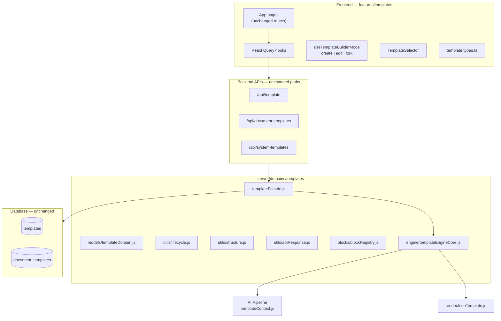

# Template Domain Architecture

## Overview

The Template feature is unified under a single **Template Domain** spanning frontend (`fe/src/features/templates/`) and backend (`server/domains/templates/`). Existing routes, tables, and UI surfaces are preserved; behavior is normalized through shared models, a unified engine, and compatibility layers.

## Design Principles

1. **One domain, multiple variants** — Email and document templates are variants of the same conceptual model, not separate products.
2. **No database migration required** — Existing `templates` and `document_templates` tables (per `db-schema.md`) remain unchanged; mapping happens in application code.
3. **Backward compatibility first** — Legacy import paths and API response aliases (`templates`, `count`) remain supported.
4. **Separation of concerns** — Layout, style, blocks, AI rules, and prompt rules are distinct; rendering never reads AI rules; AI never reads styling.

## Architecture Diagram



## Domain Model

Every template exposes common metadata:

| Field | Description |
|-------|-------------|
| `id` | UUID / text primary key |
| `name` | Display name |
| `ownerId` | `user_id` / `created_by` |
| `status` / `lifecycle` | Canonical lifecycle state |
| `source` | `user`, `official`, `community`, `system`, `legacy` |
| `templateType` | `email`, `resume`, `cv`, `cover_letter`, etc. |
| `content` | Variant-specific payload (subject/body OR layout/blocks/style) |
| `preview` | Preview URL or HTML reference |
| `metadata` | Usage, versioning, approval audit |

### Variants

| Variant | Storage | API | Content shape |
|---------|---------|-----|---------------|
| Email | `templates` | `/api/template` | `{ subject, body }` |
| Document | `document_templates` | `/api/document-templates` | `{ layout, blocks, style, aiRules }` |
| Official/System | `document_templates.is_global` | `/api/system-templates` | Same as document |
| Legacy resume skins | Filesystem | `/api/documents/resume-templates` | Handlebars themes (compat shim) |

## Unified Template Engine

`server/domains/templates/engine/templateEngineCore.js` is the single pipeline entry:

```
loadTemplate()
    ↓
prepareAiContext()  → prompt suffix + postProcess (uses structure, aiRules, NOT style fonts)
    ↓
renderHtml()        → HTML via renderJsonTemplate (uses layout/blocks/style, NOT aiRules)
    ↓
generatePreview()   → server preview pages
    ↓
postProcessAiOutput()
```

**Structure derivation:** `layout.blocks` + block titles → `structure[]` for AI section ordering (fixes prior silent no-op).

## Lifecycle

Canonical states map to legacy DB fields:

| Canonical | Legacy `approvalStatus` / `status` |
|-----------|--------------------------------------|
| `draft` | `draft` |
| `submitted` | `pending_approval` |
| `approved` | `approved` |
| `published` | `approved` + `isPublic` |
| `rejected` | `rejected` |
| `archived` | `archived` (future) |

## Builder Modes

| Mode | URL | Load source | Save action |
|------|-----|-------------|-------------|
| **Create** | `?mode=create` | Default blocks/layout | `POST /api/document-templates` |
| **Edit** | `?mode=edit&templateId=&source=user` | User document template | `PUT /api/document-templates/:id` |
| **Fork** | `?mode=fork&templateId=&source=system` | System or user template | `POST` (new copy) |

## API Response Contract

All document template list endpoints return:

```json
{
  "success": true,
  "data": {
    "items": [],
    "total": 0,
    "page": 1,
    "pageSize": 0,
    "starredIds": [],
    "templates": [],
    "count": 0
  }
}
```

Legacy keys `templates` and `count` are aliases for `items` and `total`.

## Frontend Structure

```
fe/src/features/templates/
├── types/template.types.ts      # Unified types + helpers
├── utils/normalizeListResponse.ts
├── hooks/
│   ├── useDocumentTemplates.ts  # React Query
│   ├── useEmailTemplates.ts     # React Query (replaces useState hook)
│   ├── useSystemTemplates.ts
│   ├── useTemplateBuilderMode.ts
│   └── queryKeys.ts
└── index.ts
```

Compatibility re-exports remain at:
- `@/hooks/queryHooks/documentTemplates`
- `@/hooks/queryHooks/templates`
- `@/hooks/queryHooks/systemTemplates`
- `@/types/documentTemplate`

## Scalability Hooks

The domain model reserves fields for future features without schema changes:
- `metadata.version` — version history (app-level today; join table later)
- `source` — marketplace / org templates
- `lifecycle` — permissions and publishing workflow
- Paginated list response shape — ready for `page` / `pageSize` query params
- `BLOCK_REGISTRY` — extensible block types for new document sections

## What Did Not Change

- Database tables and RLS policies
- Route paths (`/api/template`, `/api/document-templates`, etc.)
- Page URLs and visual design
- Legacy resume export path (`resumeTemplateId`)
- Email attachment linking (`parentType: email_template`)
