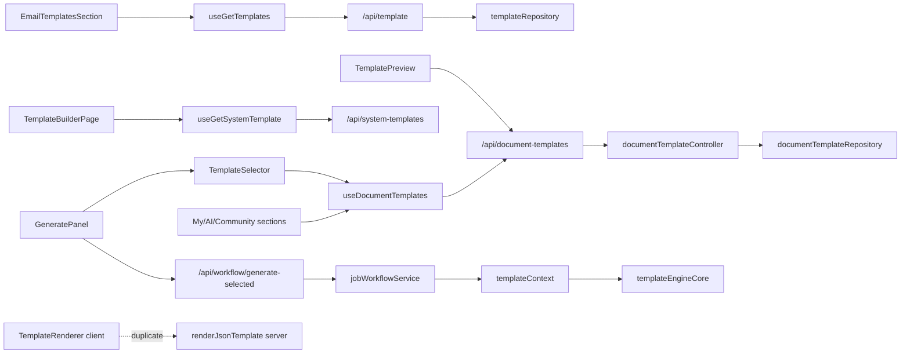

# Template Refactor Migration Guide

## Phase 1 — Audit & Dependency Graph

Internal inventory confirmed four overlapping systems (email, document, system, legacy resume). Dependency graph:



**Critical breaks identified:** API list shape mismatch, builder system-only load, email approval filter, structure vs layout schema split, usage tracking missing userId.

---

## Phase 2 — Shared Domain Model

### Created
| File | Purpose |
|------|---------|
| `server/domains/templates/models/templateDomain.js` | `mapEmailRow`, `mapDocumentRow`, `toSystemTemplateDto` |
| `server/domains/templates/utils/structure.js` | Derive `structure[]` from `layout.blocks` |
| `server/domains/templates/utils/lifecycle.js` | Canonical lifecycle + legacy mapping |
| `server/domains/templates/utils/apiResponse.js` | Standard list/item/error responses |
| `server/domains/templates/blocks/blockRegistry.js` | Canonical block definitions |
| `fe/src/features/templates/types/template.types.ts` | Unified TS types |

### Modified
| File | Change |
|------|--------|
| `server/repositories/documentTemplateRepository.js` | `fromRow()` enriches with `structure` |

**Why:** Single source of truth for template semantics without DB migration.

---

## Phase 3 — Folder Structure

### Created
```
fe/src/features/templates/
├── types/
├── utils/
├── hooks/
└── index.ts
```

### Compatibility re-exports (no import breaks)
| Legacy path | Re-exports from |
|-------------|-----------------|
| `fe/src/hooks/queryHooks/documentTemplates.ts` | `@/features/templates/hooks/useDocumentTemplates` |
| `fe/src/hooks/queryHooks/templates.ts` | `@/features/templates/hooks/useEmailTemplates` |
| `fe/src/hooks/queryHooks/systemTemplates.ts` | `@/features/templates/hooks/useSystemTemplates` |
| `fe/src/types/documentTemplate.ts` | `@/features/templates/types/template.types` |

---

## Phase 4 — Unified API Contracts

### Modified backend
| File | Change |
|------|--------|
| `server/controllers/documentTemplateController.js` | `listTemplates`, `getPublicTemplates`, `getStarredTemplates` use `templateListResponse()` |
| `server/controllers/templateController.js` | Update response includes `data` alias alongside `template` |
| `server/controllers/suggestionsController.js` | Pass `userId` to suggestions |
| `server/services/suggestionsService.js` | Scope template suggestions to authenticated user |
| `server/services/contextUsageService.js` | Pass `userId` to `bumpTemplateUsage` |

### Modified frontend
| File | Change |
|------|--------|
| `fe/src/features/templates/utils/normalizeListResponse.ts` | Parses `items`, `templates`, or raw arrays |
| `fe/src/features/templates/hooks/useDocumentTemplates.ts` | Uses normalizer on all list fetches |

**Why:** Frontend expected `{ templates, starredIds }`; backend returned raw arrays — lists appeared empty.

---

## Phase 5 — Builder Redesign

### Created
| File | Purpose |
|------|---------|
| `fe/src/features/templates/hooks/useTemplateBuilderMode.ts` | create / edit / fork loading logic |

### Modified
| File | Change |
|------|--------|
| `fe/src/app/dashboard/templates/builder/page.tsx` | Three modes; edit uses PUT; "Use Template" opens generator |
| `fe/src/components/template/MyTemplatesSection.tsx` | Routes with `mode=create|edit` |
| `fe/src/components/template/AITemplatesSection.tsx` | Fork route with `source=system` |

---

## Phases 6–8 — Engine, Separation, Blocks

### Created
| File | Purpose |
|------|---------|
| `server/domains/templates/engine/templateEngineCore.js` | Unified load / AI / render / preview |
| `server/domains/templates/templateFacade.js` | Service coordination layer |
| `server/services/templates/templateEngineUnified.js` | Shim to engine |

### Modified
| File | Change |
|------|--------|
| `server/domains/ai/core/templateContext.js` | Delegates to `templateFacade.resolvePipelineContext` |
| `server/controllers/systemTemplateController.js` | Uses `templateFacade.listSystemTemplates` |

**Separation enforced in engine:**
- `prepareAiContext` → structure + aiRules only
- `renderHtml` → layout + blocks + style only

---

## Phase 9 — State Management

| Before | After |
|--------|-------|
| Email: `useState` + `useEffect` in `templates.ts` | React Query in `useEmailTemplates.ts` |
| Document: React Query (broken parser) | React Query + `normalizeListResponse` |
| `useGetTemplates` | Alias to `useEmailTemplates` (same API) |

---

## Phase 10 — Rendering Pipeline

```
templateEngineCore.loadTemplate()
  → enrichTemplateWithStructure()
  → renderHtml() → renderJsonTemplate.js
  → generatePreview() → previewGenerator.js
```

Client `TemplateRenderer` retained for **live builder preview only** (dev UX). Server engine is authoritative for export/preview API.

---

## Phase 11 — Lifecycle

`server/domains/templates/utils/lifecycle.js` maps:
- `pending_approval` ↔ `submitted`
- `approved` + public ↔ `published`

Legacy DB fields unchanged; mapping is read-time and write-time compatible.

---

## Phase 12 — Cleanup

| Action | File |
|--------|------|
| Deleted | `fe/src/components/layout/EmailTemplate.tsx` (fully commented, unused) |
| Removed | ~470 lines commented duplicate in `GeneratePanel.tsx` |
| Fixed | `EmailTemplatesSection` approval filter hiding all templates |

---

## Phase 13 — Scalability

- Paginated response shape ready (`total`, `page`, `pageSize`)
- `BLOCK_REGISTRY` extensible for new sections
- `source` field distinguishes official/community/user/legacy
- No architectural blocker for orgs, marketplace, or version history (future tables optional)

---

## Database

**No schema migration required.** Existing tables per `db-schema.md`:
- `templates` (email)
- `document_templates` (document + system via `is_global`)
- `template_preview_data`
- `users.starredTemplates` (JSON array on user row)

See `BACKWARD_COMPATIBILITY.md` for API and import compatibility details.
