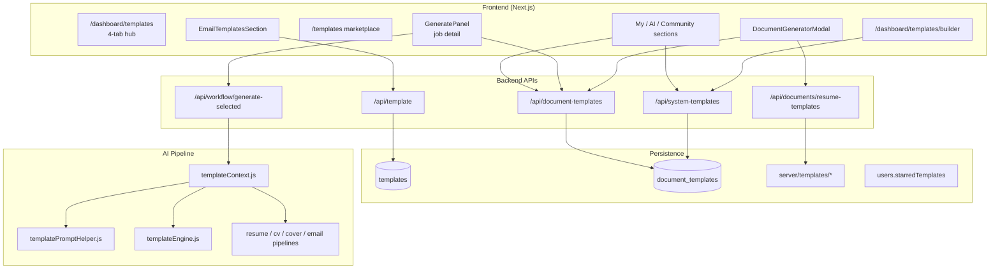
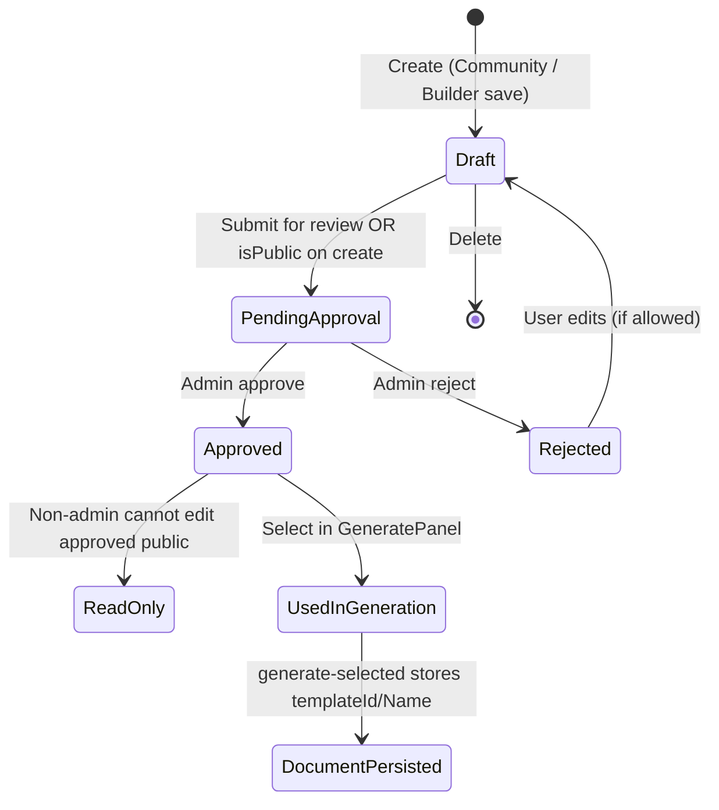
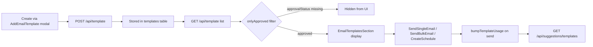
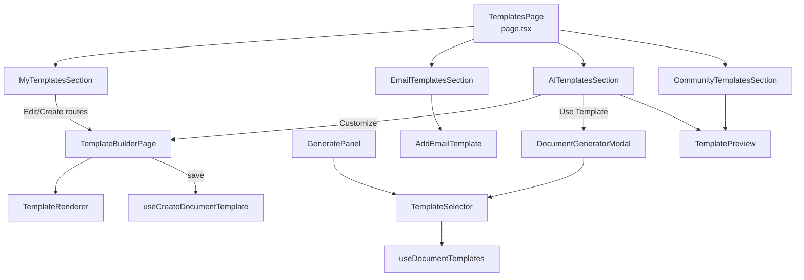
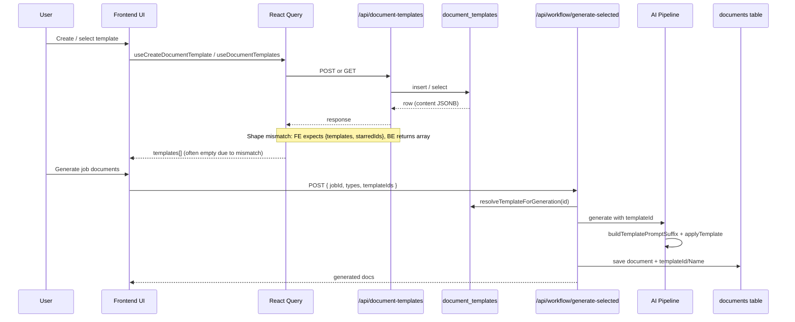
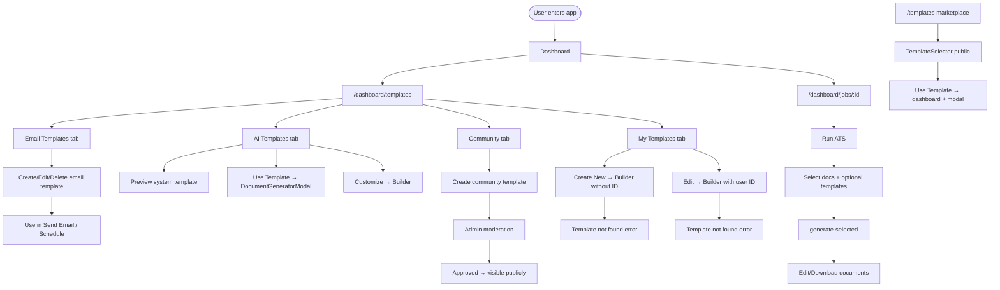

# Template Feature Audit

**Date:** July 1, 2026  
**Scope:** Full-stack Template feature (frontend + backend + AI pipeline)  
**Mode:** Read-only architecture audit — no code changes

---

## Executive Summary

The application implements **four overlapping template systems** that share UI surfaces and naming but differ in data models, APIs, and runtime behavior:

| System | Storage | API Base | Primary Use |
|--------|---------|----------|-------------|
| **Email templates** | `templates` table | `/api/template` | Outreach, scheduling, suggestions |
| **Document templates** | `document_templates` table (JSONB) | `/api/document-templates` | AI generation constraints + HTML rendering |
| **System templates** | Same table (`is_global = true`) | `/api/system-templates` | Curated AI templates + builder seed |
| **Legacy resume skins** | Filesystem + registry | `/api/documents/resume-templates` | PDF/DOCX export in `DocumentGeneratorModal` |

The Template feature is **functionally ambitious but architecturally fragmented**. Document templates drive the primary job-generation flow, yet the AI pipeline reads a **`structure`** field that document templates store as **`layout`/`blocks`**, causing section-order constraints to silently no-op. The frontend and backend disagree on list response shapes (`{ templates, starredIds }` vs raw arrays). The builder cannot load user-owned templates for edit. Email templates are filtered by an approval status the backend never sets.

**Overall assessment:** The feature works partially along happy paths (browse system templates → customize → save copy; job generation with optional template ID), but consistency, single source of truth, and several user journeys are broken or incomplete.

---

## Current Architecture

### High-level structure



### Responsibility ownership

| Layer | Owner files | Responsibility |
|-------|-------------|----------------|
| **Pages** | `fe/src/app/dashboard/templates/page.tsx`, `builder/page.tsx`, `fe/src/app/templates/page.tsx` | Tab routing, builder shell, public marketplace |
| **Document UI sections** | `fe/src/components/template/*` | CRUD lists, community create, moderation hooks |
| **Selection** | `fe/src/components/templates/TemplateSelector.tsx` | Per-doc-type picker in generation flows |
| **Email editor** | `fe/src/components/layout/AddEmailTemplate.tsx` | Email template modal CRUD |
| **Client preview** | `fe/src/components/documentBuilder/TemplateRenderer.tsx` | Live builder preview from layout/blocks/style |
| **Server preview** | `fe/src/components/template/TemplatePreview.tsx` | Authenticated HTML/image preview iframe |
| **React Query hooks** | `fe/src/hooks/queryHooks/documentTemplates.ts`, `systemTemplates.ts` | Document/system template cache |
| **Legacy email hook** | `fe/src/hooks/queryHooks/templates.ts` | Email templates via `useState`/`useEffect` (not React Query) |
| **Email API** | `server/controllers/templateController.js`, `server/repositories/templateRepository.js` | Email CRUD |
| **Document API** | `server/controllers/documentTemplateController.js`, `server/repositories/documentTemplateRepository.js` | Document CRUD, approval, preview |
| **System API** | `server/controllers/systemTemplateController.js` | Admin template listing + preview |
| **Business logic** | `server/services/templates/templateService.js` | Visibility, starring, generation resolution |
| **AI integration** | `server/domains/ai/core/templateContext.js` | Pipeline bridge |
| **Post-processing** | `server/services/templates/templateEngine.js` | Reorder AI output by `structure` |
| **HTML rendering** | `server/utils/renderJsonTemplate.js` | Export/preview from layout/blocks |
| **Workflow orchestration** | `server/services/workflow/jobWorkflowService.js` | Passes `templateIds` into AI + persists metadata |

### Separation of concerns assessment

**Clear separation exists between:**
- Email templates (subject/body) vs document templates (layout/style/aiRules)
- Repository → service → controller layering on the backend
- React Query mutations for document template CRUD

**Blurred or duplicated responsibilities:**
- `systemTemplateController` and `documentTemplateController` both read `document_templates` with different transforms
- `TemplateRenderer` (client) and `renderJsonTemplate` (server) duplicate rendering logic
- `templateEngine` (AI text post-process) vs `renderJsonTemplate` (HTML) use different schema fields (`structure` vs `layout/blocks`)
- Three resume-template concepts: document template UUID, system template, legacy `resumeTemplateId`
- Folder split: `components/template/` vs `components/templates/`

---

## Template Lifecycle

### Document template lifecycle



**Step-by-step trace:**

1. **Create**
   - *Community tab:* `CommunityTemplatesSection` → `POST /api/document-templates` with `layout`, `blocks`, `style`, optional `aiRules`, `isPublic`
   - *Builder:* `TemplateBuilderPage` loads system template via `GET /api/system-templates/:id`, saves copy via `POST /api/document-templates`
   - *My Templates "Create":* navigates to `/dashboard/templates/builder` **without** `templateId` → **fails** (builder requires system template)

2. **Save**
   - Backend stores all structural data in `document_templates.content` JSONB via `documentTemplateRepository.toRow()`
   - Initial status: `draft`; public submissions set `pending_approval`

3. **Fetch**
   - User list: `GET /api/document-templates` → `listForUser(userId)` (user-owned rows only)
   - Public: `GET /api/document-templates/public` → visibility-filtered rows
   - System: `GET /api/system-templates` → `isAdminTemplate === true`

4. **Display**
   - Hub tabs render list components with React Query or custom hooks
   - **Known break:** frontend expects `{ templates, starredIds }`; backend returns raw array in `data`

5. **Edit**
   - `MyTemplatesSection` routes to `builder?templateId=<userDocId>`
   - Builder only calls `useGetSystemTemplate` → **404 / "Template not found"**
   - `useUpdateDocumentTemplate` hook exists but **no UI uses it**

6. **Select**
   - `TemplateSelector` in `GeneratePanel` loads user templates filtered by doc type
   - Filters: `approvalStatus === "approved" || isPublic` — drafts excluded from generation
   - System templates **not included** unless user saved a copy

7. **Use in job generation**
   - `GeneratePanel` → `POST /api/workflow/generate-selected` with `templateIds: { resume?, "professional-cv"?, "cover-letter"?, email? }`
   - `jobWorkflowService` resolves each ID → `templateService.resolveTemplateForGeneration`
   - AI pipelines call `resolvePipelineTemplate` → append prompt suffix → post-process with `applyTemplate`

8. **Persist on generated document**
   - `buildTemplateFields()` stores `templateId`, `templateName`, `metadata.templateId/Name` on document record

9. **History**
   - Generated documents show `templateName` on `/dashboard/documents`
   - No template version history; edits create new rows or overwrite in place
   - Email usage tracked via `usageCount` / `lastUsedAt` (when bump succeeds)

### Email template lifecycle



Email templates have **no backend approval workflow**, yet the UI filters to `approvalStatus === "approved"`, which likely hides all user-created templates.

---

## Component Relationships



### Component issues

| Issue | Components | Impact |
|-------|------------|--------|
| **Duplicated list UIs** | `EmailTemplatesSection`, `MyTemplatesSection`, `CommunityTemplatesSection`, `AITemplatesSection` | Repeated patterns for loading, empty states, actions |
| **Oversized builder page** | `builder/page.tsx` (~425 lines) | Inline sub-components (`ColorPicker`, `BlockReorderPanel`, etc.) should be extracted |
| **Dead legacy component** | `EmailTemplate.tsx` (fully commented) | Confusion, dead code |
| **Dead preview action** | Builder dialog "Use This Template" button | Only closes dialog; does not open generator or navigate |
| **Tight coupling to system API** | `TemplateBuilderPage` → `useGetSystemTemplate` only | Breaks edit flow for user templates |
| **TemplateSelector visibility gap** | Uses user list only | System/admin templates invisible in job generation picker |
| **Prop drilling** | Minimal — mostly local state + hooks | Acceptable; no template-specific Context |

---

## Data Flow Diagram

### Document template: create → generate → persist



### Breaks in the flow

| # | Location | Break |
|---|----------|-------|
| 1 | `documentTemplates.ts` ↔ `documentTemplateController.listTemplates` | Response shape mismatch — lists appear empty |
| 2 | `EmailTemplatesSection.onlyApproved` | Filters out templates without `approvalStatus` |
| 3 | `TemplateBuilderPage` | Cannot load user document template IDs |
| 4 | `templatePromptHelper` / `templateEngine` | Reads `structure`; DB stores `layout.blocks` titles — section constraints skipped |
| 5 | `contextUsageService` | `bumpTemplateUsage(id)` called without `userId` — usage stats fail silently |
| 6 | `suggestionsService.getTemplateSuggestions` | `listTemplates()` without userId — may leak cross-user data with service role |
| 7 | `TemplateSelector` | Excludes non-approved private drafts user may expect to use |
| 8 | `POST /api/workflow/run` | Full workflow ignores `templateIds` entirely |

---

## API Analysis

### Endpoint inventory

#### Email templates — `/api/template`

| Method | Path | Auth | Validation | Response pattern |
|--------|------|------|------------|------------------|
| GET | `/` | requireAuth | userId scope | `{ message, data: [] }` |
| POST | `/` | requireAuth | name + body required | `{ message, data }` |
| GET | `/:id` | requireAuth | user scope | `{ message, data }` |
| PUT | `/:id` | requireAuth | — | `{ message, template }` ⚠️ inconsistent key |
| DELETE | `/:id` | requireAuth | — | `{ message }` |

#### Document templates — `/api/document-templates`

| Method | Path | Notes |
|--------|------|-------|
| GET | `/` | Returns `data: DocumentTemplate[]` — **not** `{ templates, starredIds }` |
| GET | `/public` | Same array shape |
| GET | `/starred` | Returns `data: DocumentTemplate[]` — FE expects list response wrapper |
| GET | `/pending` | Admin moderation queue |
| POST | `/` | Creates draft; 201 + `{ success, data }` |
| PUT/PATCH | `/:id` | Public flag triggers re-approval |
| DELETE | `/:id` | Owner or admin |
| POST | `/:id/submit-review` | Draft → pending |
| POST | `/:id/approve`, `/reject` | Admin |
| POST/DELETE | `/:id/star` | Updates `users.starredTemplates` |
| GET | `/:id/preview`, `/:id/preview.html` | HTML preview |
| POST | `/preview` | Live preview from body |

#### System templates — `/api/system-templates`

| Method | Path | Notes |
|--------|------|-------|
| GET | `/` | Admin rows transformed to `SystemTemplate` DTO |
| GET | `/:id` | Single admin template |
| GET | `/:id/preview` | Raw HTML |

#### Generation

| Method | Path | Template param |
|--------|------|----------------|
| POST | `/api/workflow/generate-selected` | `templateIds` map |
| POST | `/api/workflow/run` | **None** |
| POST | `/api/documents/generate-advanced` | `templateId` |
| GET | `/api/suggestions/templates` | Email suggestions |

### API inconsistencies

1. **Response envelopes:** Email uses `{ message, data }`; document uses `{ success, data, count? }`; email update uses `{ template }` instead of `{ data }`
2. **List payload shape:** Frontend `DocumentTemplateListResponse` never matches backend list endpoints
3. **Naming:** `/api/template` (singular) vs `/api/document-templates` (plural, hyphenated)
4. **ID conventions:** Frontend email types use `_id`; backend returns `id`
5. **Dual axios clients:** `axiosInstance` vs `apiClient` in email delete path
6. **Missing validation:** Document create accepts arbitrary JSONB fields; no schema validation on layout/blocks
7. **Error handling:** Document controllers use `asyncHandler`; email controllers do not

---

## State Management

| Concern | Mechanism | Files | Consistency |
|---------|-----------|-------|-------------|
| Document templates | React Query | `documentTemplates.ts` | Mutations invalidate `["document-templates"]` — good |
| System templates | React Query | `systemTemplates.ts` | Separate key `["system-templates"]` — good |
| Email templates | Custom hook (`useState`) | `templates.ts` | **Not** React Query — no shared cache, refetch via boolean toggle |
| Starred IDs | Server (`users.starredTemplates`) | user repo | Not returned on list endpoints FE expects |
| Generation selection | Local `useState` | `GeneratePanel`, `DocumentGeneratorModal` | Ephemeral — lost on navigation |
| Builder state | Local `useState` | `builder/page.tsx` | No dirty-state guard despite comment in MyTemplatesSection |
| Auth for admin | Zustand `useAuthStore` | Community, moderation | Only for role checks |
| Modal routing | `ProductivityContext` | `openModal("generator", { templateId })` | Bridges marketplace/AI tab → generator |

**No template-specific Zustand store or React Context.**  
**No localStorage/sessionStorage** for template preferences.

### Inconsistencies

- Email hooks bypass React Query used everywhere else for server state
- `useDocumentTemplate`, `usePreviewDocumentTemplate`, `useUpdateDocumentTemplate`, `useStarredDocumentTemplates` defined but unused in UI
- Tab state synced to URL (`?tab=`) on templates page — good pattern, but stale routes in `TopBar` (`/dashboard/templates/email`, `/cv`) don't match

---

## Database Flow

### Tables

#### `templates` (email)

```
id, user_id, name, subject, body, type, metadata (jsonb), created_at, updated_at
```

Metadata holds: `isPublic`, `usageCount`, `lastUsedAt`, timestamps.  
Attachments linked via `parentType: 'email_template'`.

#### `document_templates`

```
id, user_id, name, content (jsonb), is_global, created_by, created_at, updated_at,
rejection_reason, approved_by, rejected_by
```

`content` JSONB stores: `type`, `layout`, `blocks`, `style`, `status`, `approvalStatus`, `isPublic`, `aiRules`, `category`, `version`, `preview`, approval audit fields.

#### `users.starredTemplates`

Array of template UUID strings — not a join table; denormalized favorites.

#### `template_preview_data`

Single default profile JSON for admin-controlled preview samples.

#### Filesystem (`server/templates/`)

Legacy Handlebars themes (`modern`, `minimal`, `executive`, `corporate`) — used by resume export path, separate from `document_templates`.

### Source of truth assessment

**There is no single template model.** Parallel schemas:

| Field | AI prompt (`structure`) | HTML render (`layout`/`blocks`) | FE type (`DocumentTemplate`) |
|-------|-------------------------|----------------------------------|--------------------------------|
| Section order | `structure: string[]` | `layout.blocks: string[]` + `blocks[id].title` | Both optional on type |
| Style | `style.tone`, etc. | `style.fontFamily`, etc. | Unified `TemplateStyle` |
| Constraints | `aiRules` | same | same |

The repository `fromRow()` populates `layout`/`blocks` but **never derives `structure`** from block titles. AI and UI display diverge.

---

## User Flow

### Journey map



### Friction points

| Journey | Friction |
|---------|----------|
| My Templates → Create | Builder requires system template ID; blank create fails |
| My Templates → Edit | Same — user IDs not loadable in builder |
| Email Templates list | `onlyApproved` likely hides all templates |
| Document template lists | API response mismatch may show empty lists |
| Builder → Use This Template | Button is a no-op |
| Job generation template pick | System templates not listed; only user-owned approved/public |
| Full workflow run | No template selection path |
| Marketplace → Generate | Works via ProductivityContext preselect |
| Admin moderation | Duplicated in Community tab and `/dashboard/admin/moderation` |

---

## Feature Consistency

| Dimension | Email | Document (user) | System | Legacy resume |
|-----------|-------|-----------------|--------|---------------|
| **Naming** | "template" | "document template" | "AI/system template" | "resume template" / "layout" |
| **List hook** | `useGetTemplates` | React Query | React Query | ad-hoc fetch in modal |
| **CRUD completeness** | Full | Create/Delete/Submit; **no Update UI** | Read-only | N/A |
| **Approval** | UI expects it; BE absent | Full workflow | Pre-approved admin | N/A |
| **Preview** | Inline body text | Server HTML + client renderer | Server HTML | Thumbnail gallery |
| **Generation integration** | Schedules/email send only | `templateIds` in workflow | Via saved copy or modal | `resumeTemplateId` in export |
| **Star/favorite** | No | Yes | No | No |
| **Default tab on hub** | Email (default) | My Templates available | AI tab | — |

---

## Architecture Issues

1. **Multiple template domains without a unifying abstraction** — developers must know which API/table applies
2. **Schema bifurcation (`structure` vs `layout/blocks`)** — AI constraints partially ineffective
3. **API contract drift** — frontend types do not match backend responses
4. **Builder coupled to system-template fetch only** — breaks edit/create-from-scratch flows
5. **Three resume rendering paths** — document JSON, system templates, filesystem registry
6. **Starred templates stored on user row** — won't scale for orgs; no template entity relationship
7. **Service-role Supabase + app-level auth** — bugs in scoping (suggestions) expose data risk
8. **Commented-out duplicate code** — `GeneratePanel.tsx` (~465 lines), `EmailTemplate.tsx` entirely commented
9. **Inconsistent folder naming** — `template/` vs `templates/`
10. **E2E tests don't cover document template hub tabs or builder** — false confidence

---

## Technical Debt

### Critical

| Issue | Why it matters |
|-------|----------------|
| **API list response shape mismatch** | Document template UIs (`TemplateSelector`, My Templates, marketplace) may show zero templates even when DB has rows — core feature appears broken |
| **Email `onlyApproved` filter without backend approval** | Users create email templates that never appear in the list |
| **Builder cannot load user template IDs** | Edit and create-from-scratch flows are broken |
| **`structure` vs `layout/blocks` schema split** | Paying for "template-driven AI" that often runs without section constraints |

### High

| Issue | Why it matters |
|-------|----------------|
| **`bumpTemplateUsage` missing userId** | Email template suggestions and usage analytics unreliable |
| **`getTemplateSuggestions` unscoped list** | Privacy leak — may suggest other users' templates |
| **`useUpdateDocumentTemplate` unused** | No edit path for document templates after creation |
| **TemplateSelector excludes system templates** | User must save a copy before using curated templates in job flow |
| **Full workflow `/run` ignores templates** | Inconsistent behavior depending on which generate path is used |

### Medium

| Issue | Why it matters |
|-------|----------------|
| Email update response uses `template` key | Client code must handle special case |
| Duplicate type definitions (`TemplateLayout` in 3 files) | Type drift, maintenance cost |
| `GeneratePanel` 465 lines commented duplicate | Noise, merge conflict risk |
| Stale `TopBar` routes for template subpages | Wrong titles if those URLs are hit |
| Builder "Use This Template" no-op | Misleading UX |
| Default templates seeding commented out in `index.js` | Empty system template gallery on fresh installs |

### Low

| Issue | Why it matters |
|-------|----------------|
| Dead `EmailTemplate.tsx` | Clutter |
| `useDocumentTemplate` / `usePreviewDocumentTemplate` unused | Dead hooks |
| Mixed `id` vs `_id` in email types | Minor mapping glue in hook |
| E2E tests use conditional `if (await btn.isVisible())` | Weak assertions |

---

## Scalability Analysis

| Scenario | Current readiness | Bottleneck |
|----------|-------------------|------------|
| **100 templates per user** | Moderate | `listPublic` / `listAll` fetch entire table + filter in memory |
| **Template sharing** | Partial | `isPublic` + approval workflow exists; no fork/copy tracking |
| **Organizations** | Not supported | All ownership is `user_id`; starred on user row |
| **Version history** | Not supported | Single `version` number in JSONB; no revision table |
| **Marketplace** | Partial UI | `/templates` page exists; no payments, ratings, or search index |
| **AI-generated templates** | Partial | `aiRules` field + system templates; no automated template creation pipeline |
| **Permissions** | Basic | Owner + admin; no fine-grained roles |
| **Collaboration** | Not supported | No co-editing, comments, or locking |
| **100 concurrent preview renders** | Weak | Server-side HTML generation per request; no CDN caching of previews |

**Primary scaling blockers:** in-memory filtering in repositories, denormalized favorites, monolithic JSONB documents, lack of pagination on list endpoints.

---

## Missing Integrations

| Item | Evidence |
|------|----------|
| Builder edit integration | `useDocumentTemplate` exists; builder doesn't use it |
| Update document template UI | Hook exists, no form/wizard |
| Email approval backend | UI badges/filters reference approval; no workflow in `templateController` |
| Template usage on document generation | Document metadata stores template name; no link back to template analytics |
| Workflow run + templates | `generate-selected` only |
| System templates in job `TemplateSelector` | No fetch from `/api/system-templates` |
| Placeholder validation on create | `placeholderParser` exists server-side; community create doesn't validate |
| `templateDescriptor.ts` (Zod) | Separate domain schema unused by template UI |
| History of which template generated which doc | Partial metadata only |
| Orphan `EmailTemplate.tsx` | Fully commented legacy |
| `/dashboard/templates/email` route | Referenced in TopBar; page doesn't exist |

---

## Recommendations

1. **Establish one canonical `Template` domain model** with variants (`EmailTemplate`, `DocumentTemplate`) sharing base metadata (id, name, type, owner, status, version)
2. **Derive `structure` from `layout.blocks` at repository boundary** so AI and renderer share section order
3. **Normalize API responses** to `{ success, data: { items, starredIds?, pagination? } }` across all template endpoints
4. **Unify frontend data layer** — migrate email templates to React Query with shared query keys
5. **Fix builder load path** — support three modes: blank create, edit user template (`useDocumentTemplate`), fork system template
6. **Wire `useUpdateDocumentTemplate`** into builder save when editing existing user template
7. **Remove or implement email approval** — either drop `onlyApproved` or add status to email CRUD
8. **Consolidate resume template systems** — deprecate filesystem registry or map it into `document_templates`
9. **Extract builder sub-components** to `components/documentBuilder/`
10. **Add pagination** to list endpoints before scaling community/marketplace
11. **Fix usage tracking** — pass userId to `bumpTemplateUsage`; scope suggestions query
12. **Delete commented dead code** after verifying no imports

---

## Suggested Future Architecture

### Target folder organization

```
fe/src/
  features/templates/
    api/           # axios functions + response normalizers
    hooks/         # all React Query hooks (email + document + system)
    types/         # single template.types.ts
    components/
      email/       # EmailTemplatesSection, AddEmailTemplate
      document/    # sections, badges, preview
      builder/     # LayoutEditor, BlockPanel, StylePanel, TemplateRenderer
      selection/   # TemplateSelector (unified)
    pages/         # re-export or move from app router
    utils/         # mapDocType, deriveStructureFromLayout

server/
  domains/templates/
    models/        # shared schema + validators
    repositories/  # email + document (or unified with type discriminator)
    services/
      templateService.js
      templateRenderService.js   # merge renderJsonTemplate + previewGenerator
      templateAiService.js       # prompt suffix + post-process
    controllers/
    routes/
```

### Component boundaries

- **`TemplatePicker`** — single component; props: `variant: 'email' | 'document'`, `documentType?`, `includeSystem?`
- **`TemplateBuilder`** — mode: `create | edit | fork`; owns save/update/submit
- **`TemplatePreview`** — server HTML only; delete client duplicate or limit client renderer to builder dev preview

### Data ownership

| Data | Owner |
|------|-------|
| Template definitions | Server DB — single source of truth |
| List cache | React Query on client |
| Selected template for generation | URL search param or ephemeral job-scoped state |
| Starred IDs | Server (`users.starredTemplates` short-term; join table long-term) |

### API structure

```
/api/templates/email/*          # rename from /api/template
/api/templates/documents/*      # rename from /api/document-templates
/api/templates/system/*         # rename from /api/system-templates
```

Unified list response:

```json
{
  "success": true,
  "data": {
    "items": [],
    "starredIds": [],
    "total": 0,
    "page": 1
  }
}
```

### AI pipeline

Single entry: `resolveTemplateContext(templateId, documentType)` returns `{ promptSuffix, postProcess, renderLayout }` where `structure` is always derived from stored layout.

---

## Priority Fix List

| Priority | Item | Effort | Impact |
|----------|------|--------|--------|
| P0 | Fix document template list API response OR frontend parser | Small | Unblocks all document template lists |
| P0 | Remove/fix email `onlyApproved` filter | Small | Unblocks email template visibility |
| P0 | Builder: load user templates via `useDocumentTemplate`; allow blank create | Medium | Unblocks My Templates CRUD |
| P1 | Derive `structure` from `layout.blocks` in `fromRow()` | Small | Makes AI template constraints work |
| P1 | Pass `userId` to `bumpTemplateUsage`; scope suggestions | Small | Fixes analytics + privacy |
| P1 | Include system templates in `TemplateSelector` (or merged endpoint) | Medium | Job generation matches AI tab |
| P2 | Migrate email templates to React Query | Medium | State consistency |
| P2 | Implement document template update in builder | Medium | Complete CRUD |
| P2 | Normalize API response envelopes | Medium | Reduces client bugs |
| P2 | Remove dead code (`EmailTemplate.tsx`, commented GeneratePanel) | Small | Maintainability |
| P3 | Pagination on template lists | Medium | Scalability |
| P3 | Deprecate legacy resume-templates path | Large | Architectural clarity |
| P3 | Template version history table | Large | Marketplace / collaboration readiness |

---

## Appendix: Key File Index

### Frontend

| Path | Role |
|------|------|
| `fe/src/app/dashboard/templates/page.tsx` | Template hub |
| `fe/src/app/dashboard/templates/builder/page.tsx` | Visual builder |
| `fe/src/app/templates/page.tsx` | Public marketplace |
| `fe/src/types/documentTemplate.ts` | Primary document template types |
| `fe/src/hooks/queryHooks/documentTemplates.ts` | Document template React Query |
| `fe/src/hooks/queryHooks/systemTemplates.ts` | System template React Query |
| `fe/src/hooks/queryHooks/templates.ts` | Email template hook (legacy pattern) |
| `fe/src/components/templates/TemplateSelector.tsx` | Generation picker |
| `fe/src/components/layout/GeneratePanel.tsx` | Job-scoped generation + template IDs |
| `fe/src/components/productivity/DocumentGeneratorModal.tsx` | Standalone generator wizard |
| `fe/src/components/layout/AddEmailTemplate.tsx` | Email CRUD modal |

### Backend

| Path | Role |
|------|------|
| `server/routes/templates.js` | Email routes |
| `server/routes/documentTemplates.js` | Document routes |
| `server/routes/systemTemplates.js` | System routes |
| `server/repositories/templateRepository.js` | Email DB layer |
| `server/repositories/documentTemplateRepository.js` | Document DB layer |
| `server/services/templates/templateService.js` | Document business logic |
| `server/domains/ai/core/templateContext.js` | AI pipeline bridge |
| `server/services/templates/templatePromptHelper.js` | Prompt suffix builder |
| `server/services/templates/templateEngine.js` | AI output post-processing |
| `server/utils/renderJsonTemplate.js` | HTML rendering |
| `server/services/workflow/jobWorkflowService.js` | Generation orchestration |

---

*End of audit.*
